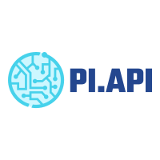

<p align="center">
  
</p>
<p align="center">
    <em>PI.API, tu API para calcular decimales con algunos datos random. </em>
</p>

## Requerimientos
Python 3.8+

La aplicación utiliza los siguientes requerimientos (se encuentran en el requirements.txt)
* fastapi
* uvicorn
* gunicorn
* pytest
* python-jose[cryptography]
* passlib[bcrypt]
* python-multipart
* requests

## Desarrollo local
Para el desarrollo en forma local, se encuentra el archivo docker-compose.yml, por lo que para ejecutar, una vez clonado el repositorio solo se necesita: 

```console
$ docker-compose -f "docker-compose.yml" up -d --build
```
En esta versión se utiliza NGINX como frontend y el puerto 8002.

## Puesta en producción GKE - Github Actions
Para ejecutarlo viene con la automatización de Github Actions con GKE el cual se encuentra en el archivo .github/workflows/gke.yml, para que se pueda utilizar, se deben realizar los siguientes pasos

### 1. Crear cuenta en GKE:

- Crear una cuenta de <a href="https://console.cloud.google.com/iam-admin/serviceaccounts">Servicio en Google Cloud</a>
- Asignar los siguientes roles de Cloud IAM:
-- Kurnetes Engine Developer
-- Storage Admin
- Crear un secreto JSON de la cuenta de servicio. 

### 2. Creación cluster GKE
TODO: Automatización via Terraform.

Primero se definirán las variables de nombre de la Zona donde se ejecutará el cluster GKE y el nombre del cluster
```console
export my_zone=zona-gke
export my_cluster=nombre-cluster
```

Posteriormente, se creará el cluster de GKE

```console
gcloud container clusters create $my_cluster --num-nodes 3 --enable-ip-alias --zone $my_zone
gcloud container clusters get-credentials $my_cluster --zone $my_zone
```
### 3. Definir parámetros de Github Actions:

Se deben definir los Secrets dentro de Github el cual deben ser los siguientes:

* GKE_EMAIL: Cuenta de servicio de GKE generada anteriormente (Debe ser formato correo)
* GKE_KEY: Archivo JSON generado de la cuenta de servicio de GKE
* GKE_PROJECT: ID Proyecto de Google Cloud
* GKE_ZONE: Zona del cluster de GKE creado. 
* GKE_CLUSTER: Nombre del cluster de GKE creado.
* IMAGE: Nombre del programa, en este caso 'pidtoapi'.

Esta versión en producción para GKE contiene un servicio LoadBalancing (web-lb.yaml) y además un HorizontalPodAutoscaler (web-autoscaler) definido previamente entre 1 a 10 imágenes que escalarán si existe una carga sobre el 35%.

Para el deployment con Github Actions de forma variable se utiliza <a href="https://kustomize.io/">Kustomize </a> 

## Puesta en producción - Manual

Si se realizará en un cluster local de Kubernetes, se deben realizar los siguientes pasos de forma manual:

### 1. Clonar código y entrar a carpeta backend

```console
git pull .
cd backend
```
### 2. Construir imagen docker

```console
docker build \
   --tag "pidotapi:latest" \
   -f "backend/Dockerfile.build" \
   backend/
```

### 3. Ejecutar pruebas 
```console
   docker run --rm pidotapi:latest pytest
```
### 4. Subir imagen
```console
   docker push pidotapi:latest
```
### 5. Deployment de imagen en K8s

```console
kubectl create -f k8s/base/web.yaml --save-config # Levantar web.yaml con imagen en pidotapi:latest
kubectl get deployment web # Ver estado del deployment
```

## Benchmark
Para realizar pruebas se programó en python una solución que utiliza locust, el cual contiene las siguientes opciones:
```console
-c: Conexiones concurrentes. Por defecto: 10
-r: Cantidad de peticiones. Por defecto: 100
-t: Tiempo total de testing. Por defecto: Cantidad/Conexiones
-u: URL/Endpoint de la API para testear. Obligatorio.
-w: Para levantar interfaz gráfica en browser. Por defecto: 0.
```

Ejemplo para ejecutar 100 conexiones y con interfaz gráfica
```console
python benchmark/bench.py -u http://127.0.0.1:8002/pi/?random_limit=100 -w 1 -r 100
```